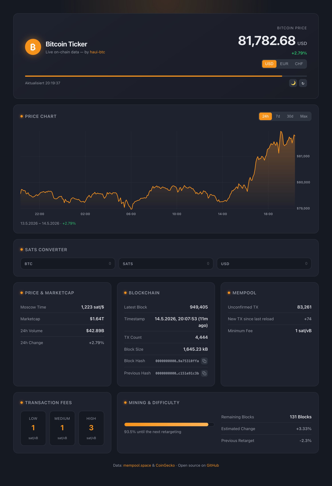

# ₿itcoin Ticker

A modern, real-time Bitcoin dashboard — price, mempool, transaction fees and
mining/difficulty data at a glance. Built with pure HTML, CSS and JavaScript:
no build step, no backend, no dependencies. All data is fetched directly in the
browser from the [mempool.space](https://mempool.space) and
[CoinGecko](https://www.coingecko.com) APIs.



## Table of contents

- [Features](#features)
- [Getting started](#getting-started)
  - [Run with a local server](#run-with-a-local-server)
  - [Run with Docker](#run-with-docker)
- [Deployment](#deployment)
- [Project structure](#project-structure)
- [Credits](#credits)

## Features

- **Live price** — Bitcoin price, market cap and 24h trading volume
- **Sats converter** — convert between BTC, sats and fiat at the live price
- **Multi-currency** — switch between USD, EUR and CHF
- **Latest block** — height, timestamp, hashes, transaction count and size
- **Mempool** — unconfirmed transactions, change since last reload, minimum fee
- **Transaction fees** — low, medium and high priority estimates
- **Mining & difficulty** — retarget progress, remaining blocks, estimated and previous adjustment
- **Auto-refresh** — updates every 15 seconds with a countdown bar and manual reload
- **Light & dark mode** — theme preference is remembered between visits

## Getting started

The app is a set of static files. Because it relies on browser API requests,
it must be served over HTTP — opening `index.html` directly via `file://` will
fail in most browsers due to CORS restrictions.

### Run with a local server

Any static file server works. For example, using Python's built-in server:

```bash
python3 -m http.server 8765
```

Then open <http://127.0.0.1:8765> in your browser.

### Run with Docker

The repository includes a Dockerfile (nginx serving the static files) and a
Compose file. Using Docker Compose:

```bash
docker compose up -d --build
```

Or with Docker directly:

```bash
docker build -t bitcoin-ticker .
docker run -d -p 8080:80 --name bitcoin-ticker bitcoin-ticker
```

Then open <http://localhost:8080>.

## Deployment

Since there is no backend, the files can be hosted as-is on any static host —
GitHub Pages, Netlify, Cloudflare Pages, or similar.

## Project structure

| File                 | Purpose                                       |
|----------------------|-----------------------------------------------|
| `index.html`         | Page structure                                |
| `style.css`          | Styling and light/dark themes                 |
| `app.js`             | API calls, rendering and auto-refresh logic   |
| `Dockerfile`         | nginx image serving the static files          |
| `nginx.conf`         | nginx configuration (gzip, cache headers)     |
| `docker-compose.yml` | Compose service definition, maps port 8080    |

## Credits

Created by [haui-btc](https://github.com/haui-btc).
Data provided by [mempool.space](https://mempool.space) and
[CoinGecko](https://www.coingecko.com).
